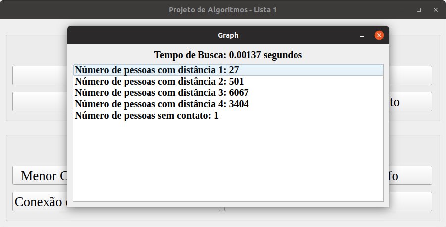

# Kevin Bacon Number

**Número da Lista**: 1<br>
**Conteúdo da Disciplina**: Grafos<br>

## Alunos
|Matrícula | Aluno |
| -- | -- |
| 17/0050394  |  Henrique Martins de Messias |

## Sobre 
O software deste repositório é uma simulação do <b>Kevin Bacon Number</b>.

## Screenshots





## Instalação 
**Linguagem**: C++<br>
Seu dispositivo deve ter o Qt5 instalado. Para fazer isso, utilize os seguintes comandos:

```bash
    $ sudo apt-get install build-essential
    $ sudo apt-get install qt5-default
```

## Uso

No terminal, vá até o diretório do exercício, que contém, além de arquivos como o README, a pasta "Graph".

Digite o seguinte comando:

  ```bash
    $ cd Graph
    $ qmake
  ```

Para compilar o código, digite:

  ```bash
    $ make
  ```

Para executar o código, digite:

  ```bash
    $ ./Graph
  ```

## Outros

Cada pessoa possui os seguintes dados:
 - ID (cada pessoa possui um, sem repetição)
 - Nome
 - Cidade
 - Quantidade de amigos

O software armazena as pessoas em um grafo, sendo esse grafo uma lista de adjacências, conectando pessoas aos seus amigos e conhecidos

 O usuário possui as seguintes opções:
  - Adicionar Pessoa (o usuário insere o nome da pessoa e a cidade em que ela mora)
  - Gerar um grafo aleatório (o usuário deve dizer quantas pessoas e relacionamentos existirão)
  - Buscar Perfil (o usuário insere o ID da pessoa, e o programa irá procurar a pessoa)
  - Adicionar Relacionamento (o usuário informará os IDs das pessoas e o programa irá cadastrar um relaciomento entre elas)
  - Menor caminho entre duas Pessoas (o usuário informará os IDs das pessoas e o programa irá calcular a menor quantidade de pessoas entre essas duas)
  - Conexão entre uma Pessoa e as outras (o usuário insere o ID da pessoa e o programa irá calcular a menor distância entre essa pessoa e todas as outras)
  - Informações sobre o grafo (o programa mostrará informações como o número de nós, número de arestas, quantidade de componentes conectados e se o grafo é bipartido ou não)
  - Estatísticas (o programa mostrará informações como quantidade de moradores por cidade, número médio de amigos por pessoa e a quantidade de memória usada para guardar as informações)